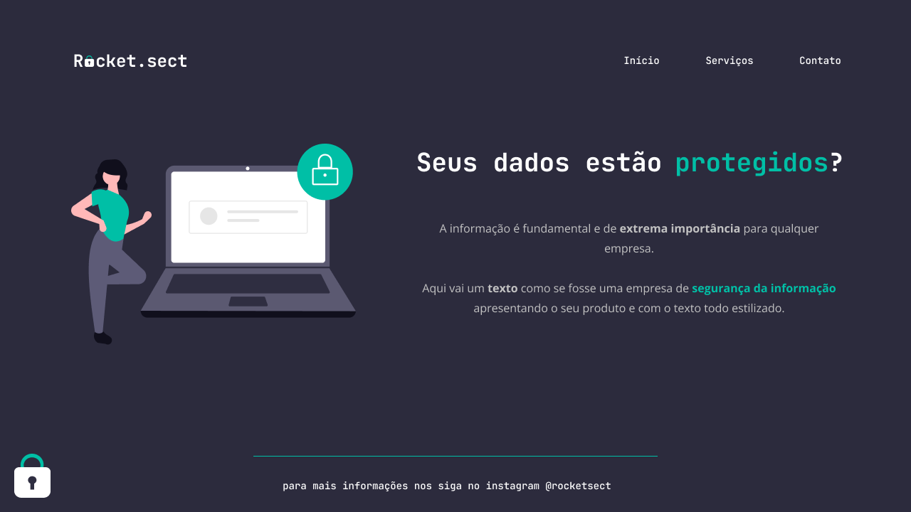

## Sobre o desafio

Nesta tarefa, desenvolvemos uma interface web básica como parte do percurso Explorer da Rocketseat.
O foco principal é consolidar os princípios essenciais de organização semântica e flexbox. 
Durante este desafio, exploramos os seguintes conceitos:

* Fundamentos de HTML e CSS para estruturar de maneira semântica
* Adquirir habilidades na utilização da ferramenta Figma
* Implementar estilos, fontes e paletas personalizadas em nossos projetos
* Compreender técnicas de posicionamento e espaçamento dos elementos usando os princípios de Modelo de Caixa e Flexbox do CSS.

## Tecnologias
- HTML
- CSS
- Figma

## Layout do desafio
<table>
  <tr>
    <td></td>
  </tr>   
</table>

## Demonstração
Aqui está uma prévia do resultado final do desafio desenvolvido
[Link Demonstração](https://rs-ferreira.github.io/Rocket.Sec/)

## Contato
Se você tiver alguma dúvida ou quiser entrar em contato, você pode me enviar uma mensagem pelo
[LinkedIn](https://www.linkedin.com/in/ronaldosf/).

